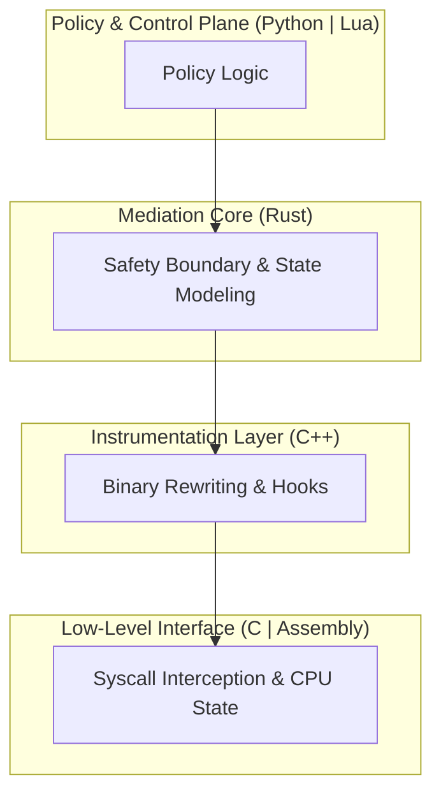

# HERMES: Policy-Driven Binary Mediation Runtime

**A policy-driven binary mediation runtime for intercepting, transforming, and controlling program behavior without source code access.**

## 1. What This Project Is

HERMES is a binary mediation runtime that operates between user-space programs and the operating system, intercepting and controlling execution without requiring access to source code or recompilation.

It treats binaries as dynamic, modifiable execution streams, not static artifacts.

HERMES enables:
*   Runtime interception of system calls and library calls
*   Behavior modification and enforcement
*   Policy-driven control of program execution
*   Dynamic instrumentation and tracing
*   Controlled execution of untrusted or opaque binaries

**This is not a debugger.**
**This is not a sandbox.**
**This is a runtime mediation layer.**

## 2. Why This Project Exists

Modern systems often execute:
*   Third-party binaries
*   Legacy software
*   Closed-source components
*   Untrusted plugins

Yet developers and operators have:
*   Little visibility into behavior
*   No control without source code
*   Poor enforcement mechanisms

HERMES exists to answer this question:
**Can we observe, control, and reshape program behavior at runtime—without recompilation—using principled systems design?**

## 3. What HERMES Actually Does

At runtime, HERMES:

1.  **Intercepts execution boundaries**
    *   Syscalls
    *   Dynamic library calls
    *   Selected instruction sequences
2.  **Analyzes execution context**
    *   Call stacks
    *   Register state
    *   Memory mappings
    *   Timing behavior
3.  **Applies mediation logic**
    *   Policy enforcement
    *   Behavior transformation
    *   Instrumentation injection
    *   Fault injection (optional)
4.  **Resumes or redirects execution**
    *   Original behavior
    *   Modified behavior
    *   Blocked behavior
    *   Emulated behavior

All of this occurs without modifying the target binary on disk.

## 4. High-Level Architecture



## 5. Technology Stack

| Component | Language | Role |
|-----------|----------|------|
| **Low-Level Interface** | Assembly (x86_64) / C | Execution boundary hooks, syscall trampolines, context capture. |
| **Instrumentation** | C++ | Instruction decoding, inline patching, CFG reconstruction. |
| **Mediation Core** | Rust | Execution state modeling, policy evaluation, memory safety. |
| **Live Scripting** | Lua | Hot-reloadable mediation rules, dynamic behavior overrides. |
| **Control Plane** | Python | High-level analysis, policy composition, trace post-processing. |

## 6. MVP Scope (Minimum Viable Product)

HERMES MVP focuses on high-signal capabilities using a **ptrace + seccomp** hybrid strategy.

### What the MVP WILL do:
*   ✔ Intercept selected syscalls (`open`, `read`, `write`, `execve`, `connect`, `sendto`)
*   ✔ Inspect arguments and return values
*   ✔ Enforce runtime policies
*   ✔ Modify behavior dynamically
*   ✔ Support hot-reload policies
*   ✔ Work on unmodified binaries

### What the MVP will NOT do:
*   ✘ Full instruction rewriting
*   ✘ Multi-architecture support
*   ✘ Kernel modules

## 7. Repository Structure

```
hermes-binary-runtime/
 ├── core/
 │    ├── rust/          # Mediation Core (Rust)
 │    └── include/       # Shared headers
 ├── intercept/
 │    ├── c/             # ABI Interface (Ptrace/Seccomp)
 │    ├── asm/           # Low-level trampolines
 │    └── seccomp/       # Syscall filters
 ├── scripting/
 │    └── lua/           # Runtime policy scripts
 ├── analysis/
 │    └── python/        # Offline analysis tools
 ├── demo/
 │    └── opaque_client/ # Target binary for demos
 └── docs/               # System documentation
```

## 8. Usage (Planned)

```bash
# Launch a binary under HERMES control
./hermes run --policy=rules/network_policy.lua ./target_binary
```
