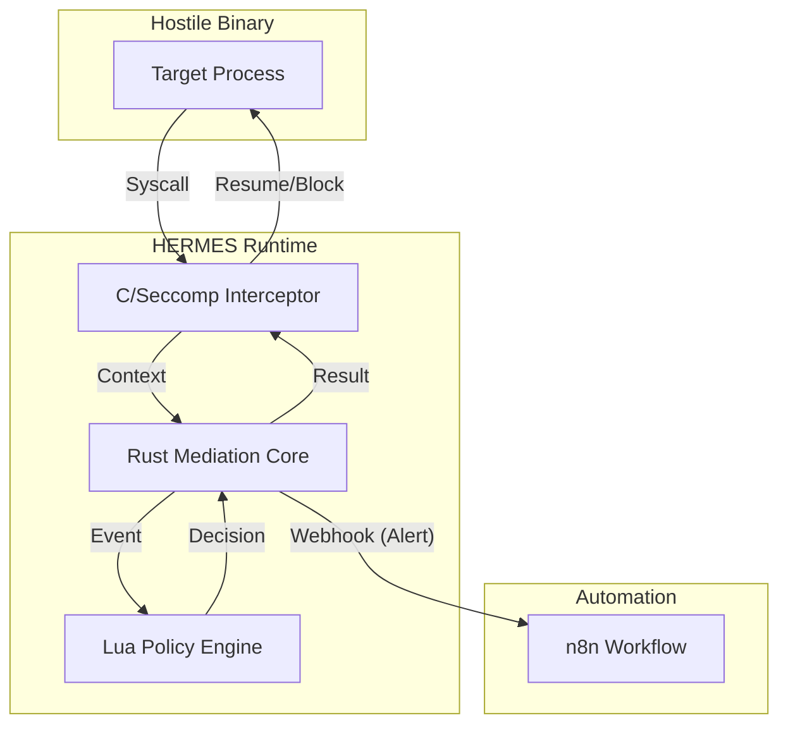

# HERMES: Policy-Driven Binary Runtime

<div align="center">


[](https://github.com/Quantum-Fiend/hermes-runtime/actions)
[](https://opensource.org/licenses/MIT)
[](https://www.rust-lang.org/)
[](https://n8n.io)

**A policy-driven execution monitor for intercepting and reshaping binary behavior without source code access.**

[Features](#-key-features) • [Installation](#-installation) • [Architecture](#-architecture) • [n8n Automation](#-n8n-security-automation) • [Contributing](#-contributing)

</div>

---

## 🚀 Overview

**HMERES** is a semantic mediation layer that operates between the user-space program and the Linux kernel. By leveraging `ptrace` and `seccomp`, it lifts raw system calls into a safe **Rust** environment where **Lua** policies determine the fate of every action.

**Why?**
Modern Ops requires control over opaque binaries (legacy, third-party, untrusted). HERMES gives you a programmable firewall for execution.

## ✨ Key Features

*   **🛡️ Safety First**: Core logic run in Rust to guarantee memory safety during mediation.
*   **⚡ Zero-Compromise Interception**: Efficient `seccomp` filtering minimizes overhead.
*   **📜 Dynamic Policies**: Hot-reload Lua scripts to change rules on the fly (No restarts).
*   **🔧 Advanced Mediation**: 
    *   **Block**: Prevent syscalls (`execve`, `connect`).
    *   **Modify**: Rewrite arguments (e.g., redirect `/etc/shadow` to `/tmp/fake`).
*   **🤖 Automation Ready**: Integrated support for n8n webhooks for security alerts.

## 🏗 Architecture



## 📦 Installation

### Prerequisites
*   Linux (x86_64) or Windows (Simulator Mode)
*   Rust 1.75+
*   `libseccomp-dev` (Linux only)

### Build
```bash
git clone https://github.com/Quantum-Fiend/hermes-runtime.git
cd hermes-runtime

# Linux (Full Production Build)
make all

# Cross-Platform (Partial Simulator)
cargo build --release --bin hermes
```

## 💻 Usage

### 1. Running a Policy
HERMES wraps your binary execution.

```bash
# General Syntax
./hermes run --policy <POLICY_FILE> --target <BINARY>

# Example: Block all network connections
./hermes run --policy policies/firewall.lua --target ./nginx
```

### 2. Simulator (Windows/Mac)
If you are developing policies on a non-Linux machine:

```cmd
run_simulation.bat
```

## 🤖 n8n Security Automation

HERMES is designed to integrate with **n8n** for realtime security operations (SecOps).

### Setup
1.  Import `integrations/n8n/hermes-security-alert.json` into your n8n instance.
2.  Configure your HERMES policy to emit JSON events on violations (coming in v1.1).
3.  Receive Slack alerts whenever a binary attempts unauthorized access.

## 📁 Repository Structure

| Path | Description |
| :--- | :--- |
| `core/rust` | **The Brain**: Safe mediation logic & Policy Engine. |
| `intercept/c` | **The Hands**: Low-level `ptrace` hooks. |
| `scripting/lua` | **The Rules**: Example policies. |
| `demo/` | **The Test**: Opaque binary for verification. |
| `integrations/` | **The Automations**: n8n workflows. |

## 🤝 Contributing
Contributions are welcome! Please read [CONTRIBUTING.md](CONTRIBUTING.md) for architectural guidelines.

---
*Built with ❤️ by [Your Name]*
